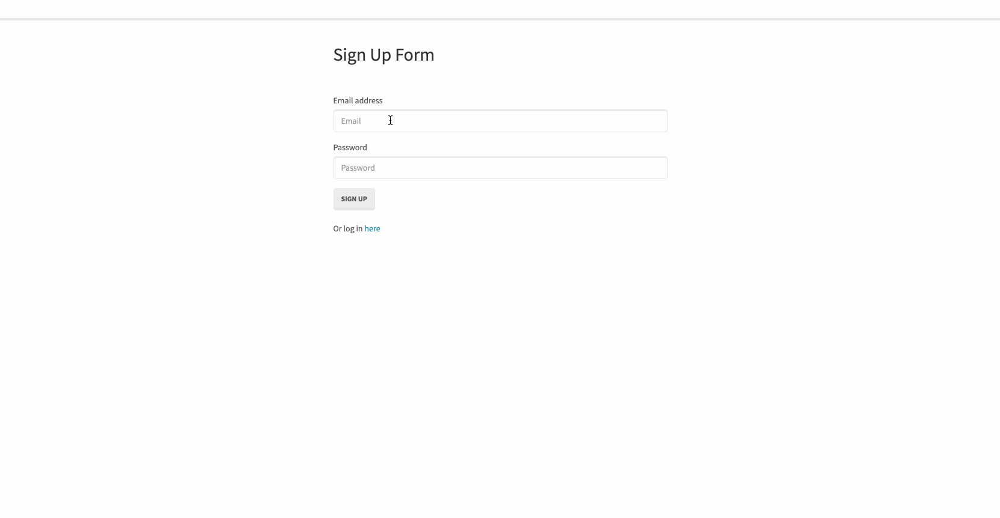

# Reverse Engineering Code

In this project, I am explaining and giving a walkthrough of the codebase for developers who need a better understanding of the functionality of the application with enough detail. The following files and their relationships to each other are going to be explained. 

This is an application wherein users can login with their email and password or signup as a new user and this creates a unique session for each user. This is a walkthrough that explains how to use the dependecy Passport which authenticates users. As well as, we are using sequelize to create our table in our database, in my case, I am using MySQL Workbench to store the user's credentials as well as requiring a bcryptjs package that encrypts the password of the user to ensure their data is secure and safe within the database that cannot be read by anyone else.

This is the directory structure:

```
.
├── config
│   ├── middleware
│   │     └── isAuthenticated.js
│   ├── config.json
│   └── passport.js         
│ 
├── models
│   ├── index.js
│   └── user.js
│
├── node_modules
│
├── public
│   ├── js
│   │   ├── login.js
│   │   ├── members.js
│   │   └── signup.js
│   │ 
│   ├── stylesheets  
│   │    └── style.css     
│   ├── login.html  
│   ├── members.html  
│   └── signup.html
│
├── routes
│   ├── api-routes.js
│   └── html-routes.js
│ 
├── .gitignore
│ 
├── package-lock.json
│
├── package.json
│
├── README.md  
│
└── server.js
```

## Table of Contents

* [Technologies Used](#technologies-used)
* [Installation](#installation)
* [Dependencies Used](#dependencies-used)
* [Code Explained](#code-explained)
* [Additional Features](#additonal-features)
* [GIF of Project](#gif-of-project)
* [Author](#author)
* [License](#license)
* [Acknowledgments](#acknowledgments)

## Technologies Used

* [Node.js](https://nodejs.org/en/)
* [Javascript](https://developer.mozilla.org/en-US/docs/Web/JavaScript)
* [jquery](https://jquery.com/)
* [MySQL](https://www.mysql.com/)
* [HTML](https://developer.mozilla.org/en-US/docs/Web/HTML)
* [CSS](https://developer.mozilla.org/en-US/docs/Web/CSS)

## Installation

### package.json

This is a file that has all the dependencies saved and other credentials. If this does not exist, you would use the following code in your terminal at the correct directory:

``` npm init -y ```
* -y is saying yes to everything

You would want to install the following dependencies if you are creating a new package.json file

``` npm install bcryptjs --save ```

``` npm install express --save ```

``` npm install express-session --save ```

``` npm install mysql2 --save ```

``` npm install passport --save ```

``` npm install passport-local --save ```

``` npm install passport-sequelize --save ```

otherwise, if this file exists run the following code:

``` npm install ```

### node_modules

Once the installation process is successful, this will exist containing the installed dependencies and this should be added into the .gitignore file that you will be creating.

### package-lock.json

This is automatically generated as well once when the installation process succeeded. This is locking the dependencies to a specific version.

### .gitignore

This file ignores certain files for other developers/users if they would like to clone down your repository. .DS_Store are specifically for mac users and node_modules, you would want to ignore because packages can have updated versions. The following files should be added into this file:

``` 
.DS_Store
node_modules
package-lock.json
```

Once the set up process is done, you can run the following code: 

```
node server.js
```
It should be listening to a PORT number that has been set through express or locally on localhost: 8080 

To do this locally, be sure to edit the config.json file to your database credentials and create a database on your MySQL Workbench and run it with these lines:

DROP DATABASE IF EXISTS passport_demo;
CREATE DATABASE passport_demo;

## Dependencies Used
  
 * [bcryptjs](https://www.npmjs.com/package/bcrypt)
 * [Express.js](https://expressjs.com/)
 * [express-session](https://www.npmjs.com/package/express-session)
 * [mysql2](https://www.npmjs.com/package/mysql2)
 * [passport](http://www.passportjs.org/docs/authenticate/)
 * [passport-local](http://www.passportjs.org/packages/passport-local/)
 * [sequelize](https://sequelize.org/v3/)

## Code Explained

### Server.js

In this file, it's connecting to a server establishing a port to be used whether it's express or a localhost 8080. With using localhost, it's a great way to to test and use for development purposes to run your application on your terminal and see whether the functionality of your application is working as it is meant to on your browser and only then, an express server will run when your application is deployed and ready for production. 

In this file, we also require dependecies, other files as well as our routes in the routes directory (html-routes.js and api-routes.js). Express-session is used to keep track of the user's login and initializes passport (a dependency that is used for user authentication).

```
// We need to use sessions to keep track of our user's login status
// creates a session for the user on the backend and returns a session ID to the user 
// when a cookie is assigned to the user, it is assigned with a secret that basically hashes the cookies so other users have no access to it
// resave determines whether a session should be updated 
// saveUnitialized creates a cookie and session for a user even if they are not logged in

app.use(session({ secret: "keyboard cat", resave: true, saveUninitialized: true }));

// the user will be able to use its cookie and its value to access data on their specific unique session
// initializes passport to allow to use local strategies

app.use(passport.initialize());
app.use(passport.session());
```

### config.json

In this file, this is where we list out our database information used in the development phase where we can run and test our application and its functionality. We set our SQL Workbech details such as username, password, the name of our database, the host and the dialect set as mysql. And in the production is where we set the details ready for deploying our application which is dependent on whether we launch on certain websites so if the user would like to deploy onto heroku the key value pair would be set in the production object as the following: 
```
"production": {
    "use_env_variable": "JAWSDB_URL",
    "dialect": "mysql"
}
```

### login.js, members.js, signup.js

These files contain the functionality of buttons, input fields, etc. that creates the interaction with the user. It listens for events and interacts with routes and other pages when the user clicks on certain parts of the page. These files are hooked onto certain tags/IDs/classes in the html files. 

```
$(document).ready(function() {
  // Getting references to our form and input
  var signUpForm = $("form.signup");
  var emailInput = $("input#email-input");
  var passwordInput = $("input#password-input");

  // When the signup button is clicked, we validate the email and password are not blank
  signUpForm.on("submit", function(event) {
    event.preventDefault();
    var userData = {
      email: emailInput.val().trim(),
      password: passwordInput.val().trim()
    };

    if (!userData.email || !userData.password) {
      return;
    }
    // If we have an email and password, run the signUpUser function
    signUpUser(userData.email, userData.password);
    emailInput.val("");
    passwordInput.val("");
  });

  // Does a post to the signup route. If successful, we are redirected to the members page
  // Otherwise we log any errors
  function signUpUser(email, password) {
    $.post("/api/signup", {
      email: email,
      password: password
    })
      .then(function(data) {
        window.location.replace("/members");
        // If there's an error, handle it by throwing up a bootstrap alert
      })
      .catch(handleLoginErr);
  }

  function handleLoginErr(err) {
    $("#alert .msg").text(err.responseJSON);
    $("#alert").fadeIn(500);
  }
});

```

### login.html, members.html, signup.html

These files display the design and layout of each of the pages of the application. It's the main skeleton that contains tags, hooks (for the js files) and is linked to stylesheets and scripts.

```
 <div class="row">
            <div class="col-md-6 col-md-offset-3">
                <!-- sign up form for new users -->
                <h2>Sign Up Form</h2>
                <form class="signup">
                    <div class="form-group">
                        <label for="exampleInputEmail1">Email address</label>
                        <input type="email" class="form-control" id="email-input" placeholder="Email">
                    </div>
                    <div class="form-group">
                        <label for="exampleInputPassword1">Password</label>
                        <input type="password" class="form-control" id="password-input" placeholder="Password">
                    </div>
                    <div style="display: none" id="alert" class="alert alert-danger" role="alert">
                        <span class="glyphicon glyphicon-exclamation-sign" aria-hidden="true"></span>
                        <span class="sr-only">Error:</span> <span class="msg"></span>
                    </div>
                    <button type="submit" class="btn btn-default">Sign Up</button>
                </form>
                <br />
                <p>Or log in <a href="/login">here</a></p>
            </div>
        </div>
```

### style.css

This file is linked to the html pages where you can add more customization on styling and design on each of those html pages.

### html-routes.js

In this file, it requires the path for the reason that it will be using the relative routes to the HTML files in the public directory. It also requires the file in the middleware directory for checking if the user has logged in. 

This is where that if the user has an account and successfully logs in or signs up, then the user will be sent to the members page which is the equivalent path of our members.html found in the public directory otherwise, they will be sent back to the signup.html page if they are signing up as a new user and the inputs are invalid or the login.html page if their login credentials don't match with the ones stored in the database. 

As for the members page, the middleware is being passed as the second argument where it restricts the access to non-members who try to go into the members route/page but will be redirected back into the signup html page. In that middleware, if the user exists and logs in, it calls the next function sending them to the html page for members which is the next argument And this is being exported to be required by server.js file.

```
// to be used in the server.js

module.exports = function(app) {

    app.get("/", function(req, res) {
        // If the user already has an account send them to the members page

        if (req.user) {
            res.redirect("/members");
        }
        res.sendFile(path.join(__dirname, "../public/signup.html"));
    });

    app.get("/login", function(req, res) {
        // If the user already has an account send them to the members page

        if (req.user) {
            res.redirect("/members");
        }
        res.sendFile(path.join(__dirname, "../public/login.html"));
    });

    // Here we've add our isAuthenticated middleware to this route.
    // If a user who is not logged in tries to access this route they will be redirected to the signup page
    // the next function in the isAuthenticated middleware is basically saying that if the user logs in successfully, continue to the next argument which is sending users to the members page

    app.get("/members", isAuthenticated, function(req, res) {
        res.sendFile(path.join(__dirname, "../public/members.html"));
    });

};
```

### isAuthenticated.js

In this file, the code restricts the routes to the user. if user successfully logs in, then execute the next function function then redirects the user to the members page otherwise they will be redirected back to the signup page. This is being required by the file "html-routes.js" to access and execute the authentication process.

```
module.exports = function(req, res, next) {
    // If the user is logged in, continue with the request to the restricted route
    // the next function would run the next argument in the html-routes.js file redirecting them to the members html page once login/signup is successful
    if (req.user) {
        return next();
    }

    // If the user isn't logged in, redirect them to the login page
    return res.redirect("/");
};
```

### api-routes.js

In this file, it requires the models directory as a whole if there was more than one model. This file is where we can find the post and get requests. 

This file requires the passport.js file in the config folder. This file is authenticating the users credentials using local strategy. If the user's login is valid and successful, they will be redirected to the members page otherwise they will be sent an error if either the username or password input was wrong. This is where new users also can choose to signup and the password is automatically hashed and stored in the database. When the user is logged in, they can see their date displayed as a response in the "/api/user_data/" otherwise, if they are not logged in, the user will just recieve a response of an empty object. This file is where it will grab the data from post requests of the user to be stored in the database and the get requests is where it displays the information to the page. The logout route will send the user back to the main login page. This file is being used by server.js to run the appropriate routes.

```
// to be used in the server.js
module.exports = function(app) {
  // Using the passport.authenticate middleware with our local strategy.
  // If the user has valid login credentials, send them to the members page.
  // Otherwise the user will be sent an error
  app.post("/api/login", passport.authenticate("local"), function(req, res) {
    res.json(req.user);
  });

  // Route for signing up a user. The user's password is automatically hashed and stored securely thanks to
  // how we configured our Sequelize User Model. If the user is created successfully, proceed to log the user in,
  // otherwise send back an error
  app.post("/api/signup", function(req, res) {
    db.User.create({
      email: req.body.email,
      password: req.body.password
    })
      .then(function() {
        res.redirect(307, "/api/login");
      })
      .catch(function(err) {
        res.status(401).json(err);
      });
  });

  // Route for logging user out
  app.get("/logout", function(req, res) {
    req.logout();
    res.redirect("/");
  });

  // Route for getting some data about our user to be used client side
  app.get("/api/user_data", function(req, res) {
    if (!req.user) {
      // The user is not logged in, send back an empty object
      res.json({});
    } else {
      // Otherwise send back the user's email and id
      // Sending back a password, even a hashed password, isn't a good idea
      res.json({
        email: req.user.email,
        id: req.user.id
      });
    }
  });
};
```

### passport.js

In this file, it requires the dependencies passport and passport-local and requires the models directory. Using local strategy, it is telling passport, to use certain strategies such as username/email and password. And in this file, it is where the user inputs in the required fields and then it runs the function that looks for the user's credentials in the database. If the values don't exist then the user recieves a response or a message for incorrect inputs otherwise, if the login credentials exist in the database then the user will be redirected to the members route. Using new LocalStrategy, we specifically want the user to use email as the input field instead of the default of setting up a username. Once authentication passes, it then makes a session and stores as a cookie so that it keeps the authentication state where users don't have to login every time to verify themselves when navigating in other parts/pages/routes in the website. This is file is being required by "api-routes.js".

```
// Telling passport we want to use a Local Strategy. In other words, we want login with a username/email and password

passport.use(new LocalStrategy(
    // Our user will sign in using an email, rather than a "username"
    {
        usernameField: "email"
    },
    function(email, password, done) {
        // When a user tries to sign in this code runs
        // this finds the user's credentials that was stored in the database
        db.User.findOne({
            where: {
                email: email
            }
        }).then(function(dbUser) {
            // If there's no user with the given email
            if (!dbUser) {
                return done(null, false, {
                    message: "Incorrect email."
                });
            }
            // If there is a user with the given email, but the password the user gives us is incorrect
            else if (!dbUser.validPassword(password)) {
                return done(null, false, {
                    message: "Incorrect password."
                });
            }
            // If none of the above, return the user
            return done(null, dbUser);
        });
    }
));
// In order to help keep authentication state across HTTP requests,
// Sequelize needs to serialize and deserialize the user
// Just consider this part boilerplate needed to make it all work

passport.serializeUser(function(user, cb) {
    cb(null, user);
});

passport.deserializeUser(function(obj, cb) {
    cb(null, obj);
});
```

### index.js

This is a file that is created and provided by Sequelize which is a dependency. In this file, this requires the file system, path, and sequelize. For fs it's a package the reads and writes files. For the path, it's the respective paths of your local machine and the basename variable is grabbing the filename "index.js" found in our models directory. The config variable is importing or requiring the "config.json" file so that we can set the env variable into development mode. To set up our database connection it utilizes an if/else statement stating that if we are on production mode, run the "use_env_variable" usually set to "JAWSDB_URL" if we were deploying the application else, the database will run on the development mode. 

It reads the directories and filters out the files that contain are js files and not including the basename which is the "index.js" file and creates a new array. 

It is then running through each file in the models directory and then storing it into the empty db object. This boiler plate file allow us to manipulate data.

```
// this is a file provided by sequelize which is a dependency we've installed
// this indicates that the code should be executed in this mode
'use strict';

// requiring filesystem, path, sequelize, and the config.json in the config directory
// fs allows to work with the filesystem on your local machine
// path allows you to work with the file and directory paths
// requires the package sequelize that allows us to manipulate data
var fs = require('fs');
var path = require('path');
var Sequelize = require('sequelize');
// basename is set at index.js in the models directory
var basename = path.basename(module.filename);
var env = process.env.NODE_ENV || 'development';
// requires the config.json and setting the environment to development
var config = require(__dirname + '/../config/config.json')[env];
// empty object for the models
var db = {};

// if production environment set up sequelize connection else use the development environment
if (config.use_env_variable) {
    var sequelize = new Sequelize(process.env[config.use_env_variable]);
} else {
    var sequelize = new Sequelize(config.database, config.username, config.password, config);
}

fs
// reads the files inside the models directory and filters the files looking specifically for js files except for the basename set at index.js and creating a new array
    .readdirSync(__dirname)
    .filter(function(file) {
        return (file.indexOf('.') !== 0) && (file !== basename) && (file.slice(-3) === '.js');
    })

// sets each model into the empty object which will be imported as a table
.forEach(function(file) {
    var model = sequelize['import'](path.join(__dirname, file));
    db[model.name] = model;
});

// each key in the db object will be looped through and each model that has any connections to the tables will run that associate method
Object.keys(db).forEach(function(modelName) {
    if (db[modelName].associate) {
        db[modelName].associate(db);

    }
});

db.sequelize = sequelize;
db.Sequelize = Sequelize;

module.exports = db;
```

### user.js

In this file, it requires the bcryptjs package which hashes the user's password. This is where we create our User model so this is creating the table named Users with sequelize and the columns included are email and password. For each of the columns, there are settings we put such as validation, unique values, type of data, etc. This table data even if not seen on the script itself, sequelize creates ids that auto increments as well as datetime.

In this file, there is a method for the user model where it compares the values of the user's input in the password field to the encrypted password stored in the database.

The addHook is just setting when do we prefer to start encrypting the user's password and in this case, we set it as "beforeCreate" so even before the user is created, the password is hashed automatically. This file is being required by "passport.js", "api-routes.js" and "server.js".

```
module.exports = function(sequelize, DataTypes) {
  var User = sequelize.define("User", {
    // The email cannot be null, and must be a proper email before creation
    email: {
      type: DataTypes.STRING,
      allowNull: false,
      unique: true,
      validate: {
        isEmail: true
      }
    },
    // The password cannot be null
    password: {
      type: DataTypes.STRING,
      allowNull: false
    }
  });
  // Creating a custom method for our User model. This will check if an unhashed password entered by the user can be compared to the hashed password stored in our database
  User.prototype.validPassword = function(password) {
    return bcrypt.compareSync(password, this.password);
  };
  // Hooks are automatic methods that run during various phases of the User Model lifecycle
  // In this case, before a User is created, we will automatically hash their password
  User.addHook("beforeCreate", function(user) {
    user.password = bcrypt.hashSync(user.password, bcrypt.genSaltSync(10), null);
  });
  return User;
};

```

### README.md

This is a file that contains the description of an application/project containing necessary information on the functionality of the application, installation, technologies used, authors, acknowledgments, licenses, etc. This is a file that further describes and gives explanation for other developers or users to look over to give them a better understanding and/or a set of instructions. It is a form of documentation that goes into detail and can let viewers of the repository know if there were additional changes/updates as well.

## Additional Features

I would fix the errors on the sign up form where it returns as "[object Object]" and it's not an actual message of which input field was incorrect whether it was the email or the password. 

I'd also fix the login page where it doesn't send a user a response whether the login was unsucessful. It just clears the input fields so I would fix that by adding a feature that lets the user know if there were invalid inputs and/or the user not existing in the database to go to the signup page instead.

I would also set a password character length since I can create password a password with just one character. I'd probably would like to also allow them to add special characters and would like to have settings where they would need at least one number and an uppercase letter.

I would add content to the members page so that once they gain access and signup/login, they would be presented with something more than a welcome message and a logout link just so that the user would see the reason of creating an account on the page and becoming a member of said website. I'd also add more styling.

## GIF of Project



## Author

* Janessa Reeanne Fong

- [Link to Github](https://github.com/janessaref)
- [Link to LinkedIn](https://www.linkedin.com/in/janessafong)
- [Link to Portfolio](https://janessaref.github.io/my-portfolio/)

## License

This project is licensed under the MIT License 

## Acknowledgments

* I'd like to acknowledge my tutor Andrew Knapp.
* To my mentors and instructors, Roger Lee, Kerwin Hy, and Manuel Nunes for helping and teaching me throughout this program.
